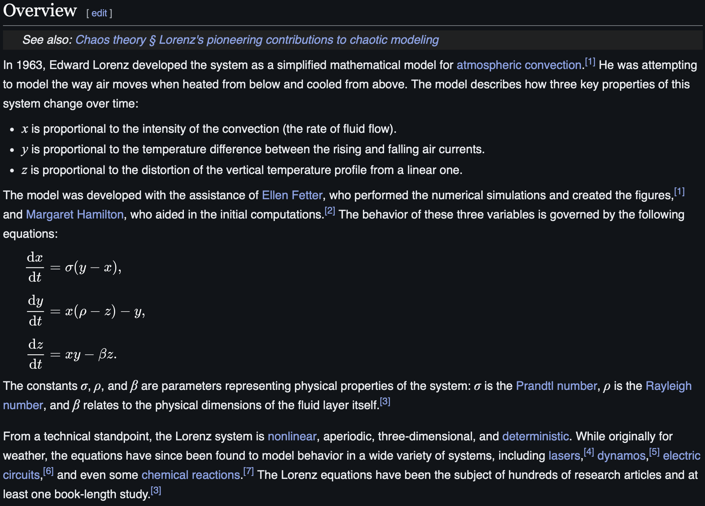
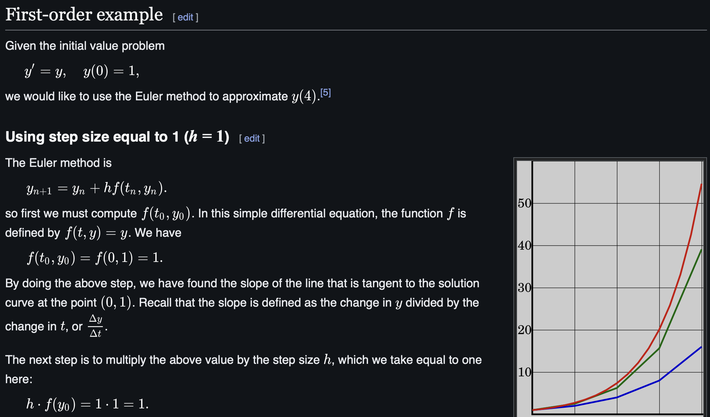
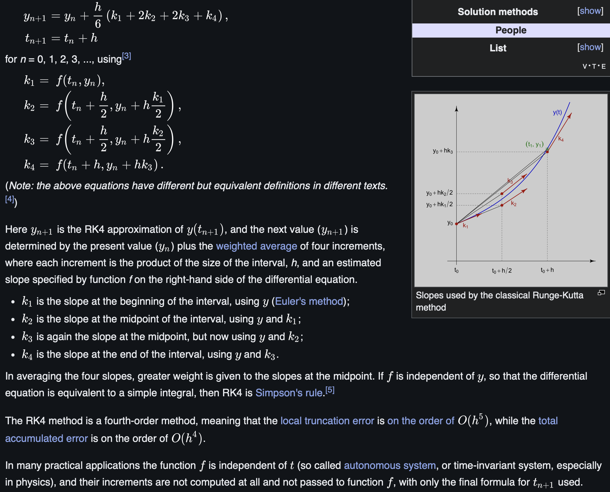
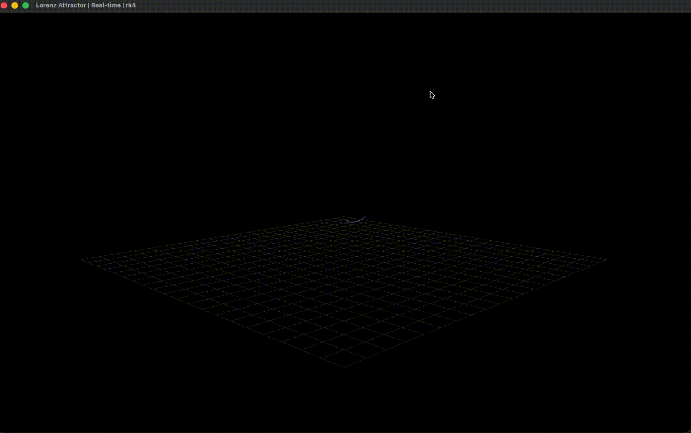

# The Butterfly Effect: A Computational Journey Through Chaos 🦋

## Exploring the Mathematical Beauty of Deterministic Chaos

> _"Does the flap of a butterfly's wings in Brazil set off a tornado in Texas?"_ - Edward Lorenz

This project implements a high-performance C++ simulation of the **Lorenz Attractor**, one of the most iconic examples of deterministic chaos in dynamical systems theory. Through numerical integration techniques and real-time 3D visualization, we explore how simple nonlinear differential equations can produce infinitely complex, yet beautifully structured behavior.


*The iconic butterfly-shaped strange attractor emerging from chaos*

---

## 🧠 The Mathematics Behind the Magic

### The Lorenz System: Where Order Meets Chaos

The Lorenz attractor emerges from a deceptively simple system of three coupled nonlinear ordinary differential equations (ODEs):



```mathematica
dx/dt = σ(y - x)
dy/dt = x(ρ - z) - y
dz/dt = xy - βz
```

Where the classic parameters are:

-   **σ = 10** (Prandtl number - relates momentum and thermal diffusion)
-   **ρ = 28** (Rayleigh number - measures buoyancy vs viscous forces)
-   **β = 8/3** (geometric aspect ratio)

### The Emergence of Chaos

What makes this system extraordinary is its **sensitive dependence on initial conditions** - the hallmark of chaos. Two trajectories starting arbitrarily close together will exponentially diverge, yet remain bounded within a finite phase space, creating the iconic "butterfly-shaped" strange attractor.

**Lyapunov Exponent**: λ ≈ 0.9056, indicating strong chaotic behavior
**Fractal Dimension**: D ≈ 2.06, revealing the attractor's non-integer dimensionality

---

## 🔬 Numerical Methods: Precision in the Face of Chaos

This implementation showcases two fundamental numerical integration schemes for solving systems of ODEs:

### Euler's Method



The simplest first-order method:

```cpp
x_{n+1} = x_n + h·f(x_n, t_n)
```

**Pros**: Computationally efficient, easy to implement
**Cons**: Lower accuracy, potential for numerical instability

### Runge-Kutta 4th Order (RK4)



A fourth-order method providing superior accuracy:

```cpp
k1 = h·f(x_n, t_n)
k2 = h·f(x_n + k1/2, t_n + h/2)
k3 = h·f(x_n + k2/2, t_n + h/2)
k4 = h·f(x_n + k3, t_n + h)
x_{n+1} = x_n + (k1 + 2k2 + 2k3 + k4)/6
```

**Trade-off Analysis**: RK4 requires 4× the function evaluations but provides O(h⁴) vs O(h) accuracy.

---

## 🎨 Visualizations: Chaos in Motion

### Real-Time 3D Trajectory Rendering
Our PyQtGraph-based visualization engine renders the attractor's evolution in real-time, with gradient coloring to show temporal progression from violet (early) to yellow (late).

  

*Left: Real-time trajectory formation | Center: Top view showing bilateral symmetry | Right: Bottom perspective revealing 3D structure*

*All demonstrations generated with 100,000 integration steps (dt = 0.001) for maximum temporal resolution*

---

## 🚀 Performance & Optimization

### Computational Specifications

-   **High-Resolution Mode**: 100,000 steps, dt = 0.001 (demo quality)
-   **Interactive Mode**: 10,000 steps, dt = 0.01 (faster computation)
-   **Memory Efficiency**: Streaming CSV output prevents memory overflow
-   **Modular Architecture**: Templated C++ design for extensibility

### Numerical Stability Analysis

The choice of time step (dt) is critical for maintaining solution accuracy:

-   **dt = 0.001**: Excellent accuracy, captures all dynamical features
-   **dt = 0.01**: Good balance between speed and precision
-   **dt > 0.05**: Risk of numerical artifacts and trajectory divergence

---

### Key Features

-   **Method Agnostic**: Choose between Euler and RK4 at runtime
-   **Cross-Platform**: CMake build system for portability
-   **Research Ready**: CSV output compatible with MATLAB, Python, R

---

## 🔬 Research Implications

The Lorenz system isn't just mathematical art—it has profound applications:

-   **Meteorology**: Original context for weather prediction limitations
-   **Fluid Dynamics**: Simplified model of Rayleigh-Bénard convection
-   **Nonlinear Dynamics**: Benchmark system for chaos theory research
-   **Computational Physics**: Testing ground for numerical methods
-   **Machine Learning**: Dataset for time series prediction algorithms

---

**Built with**: C++, CMake, Python, PyQtGraph, NumPy, Pandas  
**License**: MIT | **Author**: Ezzeldin Salah

*Mathematical equation images sourced from Wikipedia under Creative Commons licenses.*